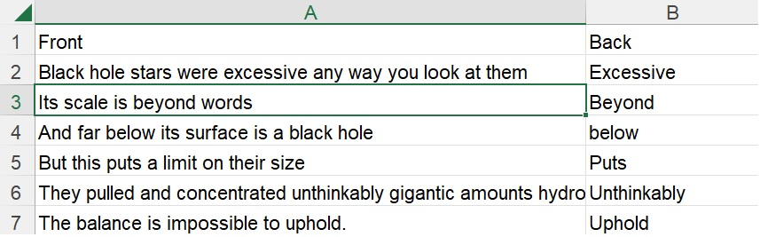
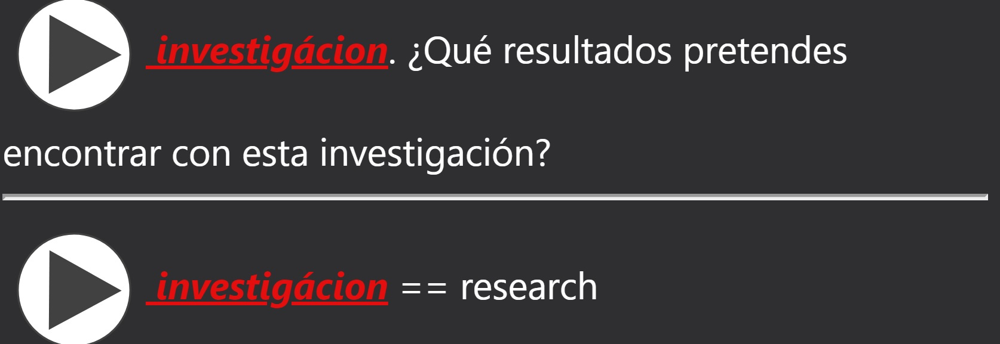
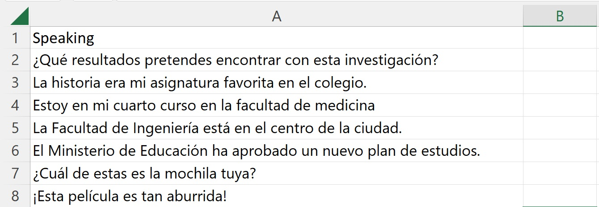
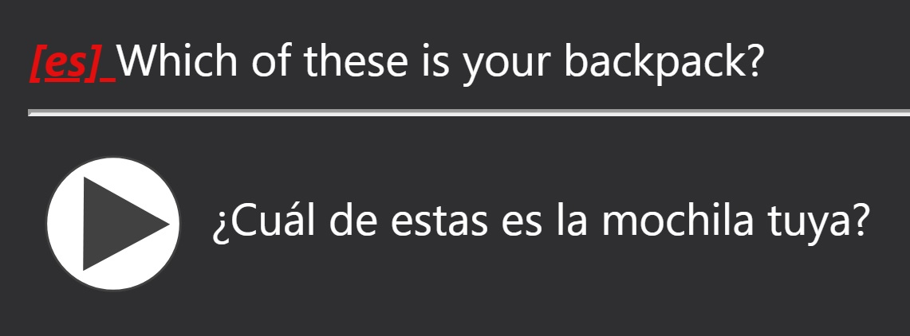
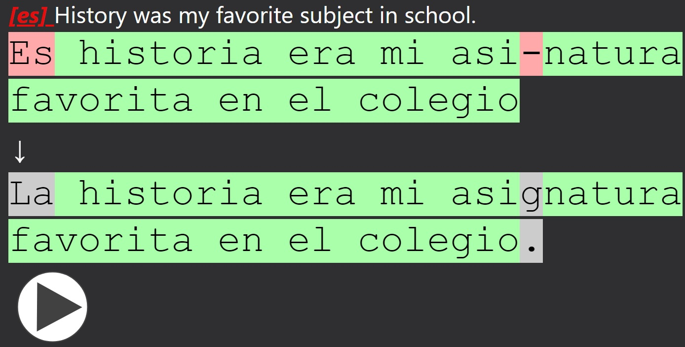
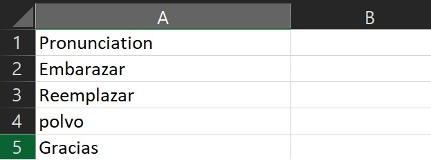
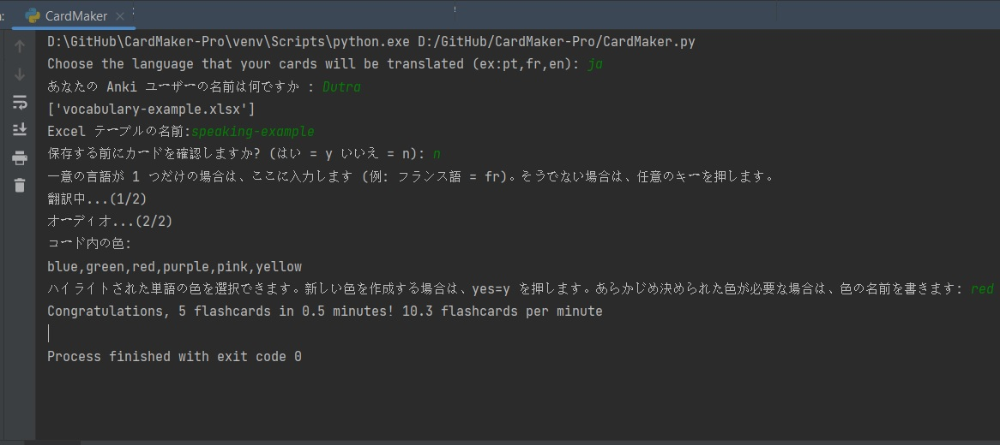
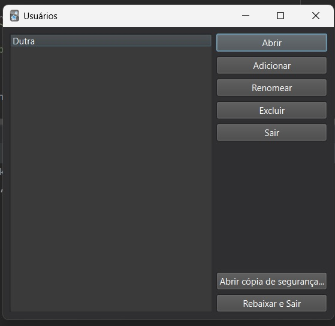
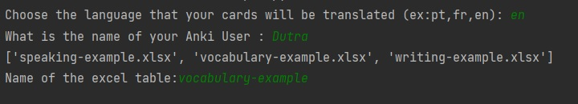
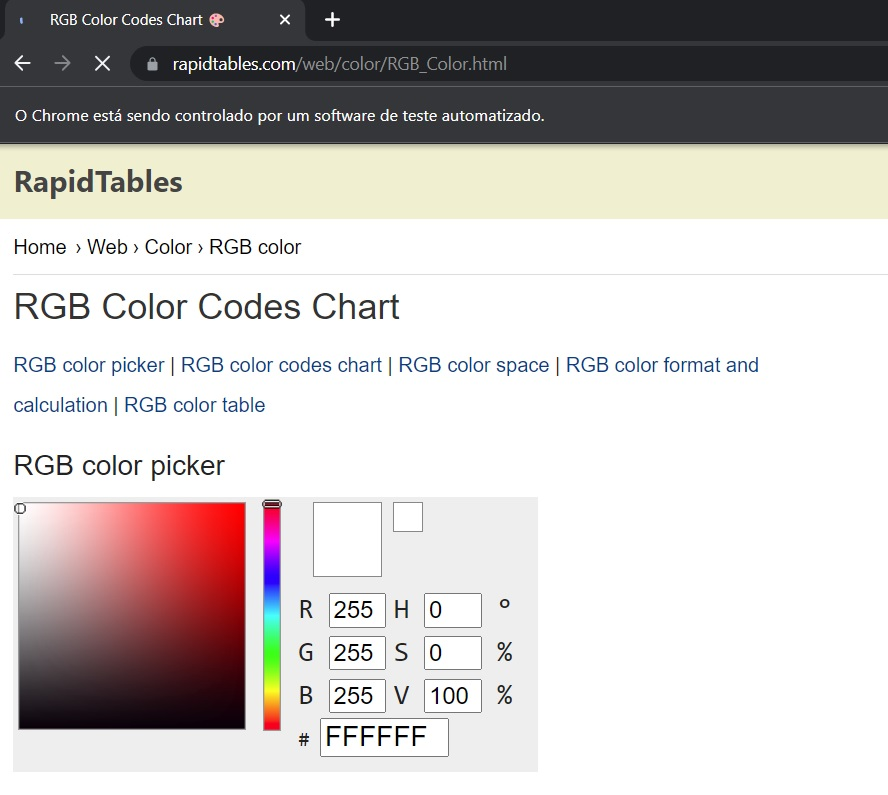

# *CardMaker is a library to create anki language learning cards programmatically*

## Creator
Hey my name is Vinícius Dutra and I'm currently studying computational physics at USP São Carlos, I'm the creator of the Brazilian youtube channel [Singularidade](https://www.youtube.com/Singularidade). I created a video explaining this library, it is the same thing that is written here but in video, the video is subtitled in multiple languages (Portuguese, English, Spanish and French) if you want to watch the video, this is the video link

## What it does?
You will need to save your phrases (in the foreign language that you are studying) in one excel table, the code will highlight the word that you want to know and provide a possible translation for that word. Besides that, the code will create a temporary translation for the phrase in order to help you judge if the translation of the word is correct, if not, inside the code you can change the translation. After that, the code will create a deck .apkg file (Anki file) with audio in the front and at the back of the card. The code has 4 card modes (vocabulary, speaking, writing and pronunciation) and many more features that will be explained in the following topics
## Language Support (+200):
The code uses Google Translate API to translate and create voice audios, so theoretically the code should work with all the languages supported by the API, here's a list of all the [supported languages](https://cloud.google.com/text-to-speech/docs/voices?hl=pt-br)
## Run in Google Colab
It is also possible to run the code on Google Colab using the **CardMaker (google colab)**, some additional steps to add the audio will be required, so please read the bullet list in the google colab, but the code is the same, just click [here](https://colab.research.google.com/github/viniciusdutra314/CardMaker/blob/main/CardMaker%20(google%20colab).ipynb).

## Installation

The code was created using a variety of external python libraries, fortunately, all of them can be installed using the !pip install command, just be aware that some libraries (googletrans==3.1.0a0) have a specific version used. Here is the list of all the commands to install and the reason why the code uses these external libraries: 
```python
!pip install colorama #colors in the terminal
!pip install genanki #integration with anki
!pip install googletrans==3.1.0a0 #uses google translate
!pip install gtts #make audios
!pip install multiprocessing #count the number of cores
!pip install pandas #handle the excel tables
!pip install selenium #change the color of the highlighted word using a website
!pip install threading #multithreading processing
!pip install xlsxwriter #create excel tables
!pip install openpyxl 
```
 
## Type of Cards
### Formatting
All the excel tables used are in the folder [Tables examples](https://github.com/viniciusdutra314/CardMaker/tree/main/Tables%20examples). All the examples were created thinking of a person that was studying Spanish.
The first row of the excel is what determines the type of card, so please copy this first row exactly as it is shown in the images, otherwise, the code will not run because it doesn't have a card type selected. 

## Vocabulary
#### Excel Table
In the **Front** column you should put the phrases that you want to learn and in the **Back** the words that you do not know

#### Result
The front of the card is the phrase with the unknown word highlighted and the back is the translation of the word (front and back have audios)



## Speaking
#### Excel Table
In the first column **Speaking** you should put the phrase that you want to speak, there is no second column, only the first one.



#### Result
The idea is to create active vocabulary, you have a phrase that you need to say in another language



## Writing

#### Excel Table
It is very similar to the card type **Speaking**, in terms of excel you just need to put the phrases in the **Writing** column.


#### Result
This mode is based on the "type in answer", you training your writing, and any mistake will appear as red



## Pronunciation

#### Excel Table
Make a list of all the words or phrases that you want to learn how to pronounce



#### Result
The front is the word that you're learning how to pronounce and the back is just one audio with the pronunciation


# Running the Code
First of all, the **ENTIRE** code was commented on, if you have any technical questions just look at the code.
This is not a comprehensive explanation of the code, the code is self-explanatory, I'll just highlight the most important parts and recommendations

## Choose the language that your cards will be translated
I create the code in multiple languages, so the first line will ask you about your language, type in the format of 2 characters. If you don't know how is your language in that format or if your language has support, access this [link](https://py-googletrans.readthedocs.io/en/latest/)

For sake of showing that this really works in any language, here's the entire code in Japanese (using "ja" as the chosen language)



## What is the name of your Anki User
On Google Colab, this will not appear, but if you have installed on your computer you should type the name of your Anki account, in my case is "Dutra"



## Audio issues
The code is considering a standard windows-based anki installation, so if there's any audio-related problem, you should change the audio_path in the code (audio_path= path of the anki collection.media), if the problem persists, when the user is asked you can type "extract", now the code will create a zip file called audio that you can copy and past the audios manually to the collection.media folder.

## Cards are disappearing

In order to accelerate the processing, the code uses multiple cores at the same time, which can cause some troubles in old PCs (mainly, some cards are just removed from the deck). In the first line of the code, type you're chosen language and after it !1, this means that the code will use just one core to process, you can also use any number of cores !number of cores (obviously your PC need to have at least this number of cores)

## Name of the excel table
It will appear a list with all the excel tables found in the folder that you are executing the code (in Google Colab is in archives), now you type the table that you want, you should not include the ".xlsx"



## Checking Modes: 
On my tests, if you are using the **Vocabulary** mode is highly recommended to check the cards before saving. In the **Writing and Speaking**  modes the code will create a temporary excel table that should be checked and modify if needed

## If there's just one unique language, type it here (Example: French=fr), if not, press any key:
You can create excel tables with multi-languages at the same time and the code will identify the languages automatically, but this comes with a cost that sometimes the language will be identified incorrectly, but the language can be corrected if the check mode is activated. If you are dealing with just one language is highly recommended to specify the language right in the beginning, with no probability of error.

## Colors

In the last step, the code will ask what color you want to use to highlight the cards, there are some default colors (red, yellow, purple, green...) But you can create a custom color giving the R G B numbers, the code will open a [website](rapidtables.com/web/color/RGB_Color.html) where you can get these informations



