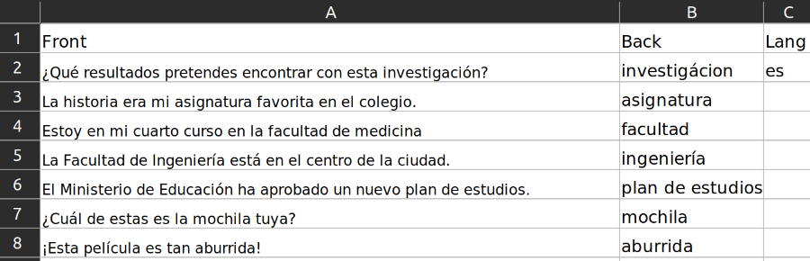
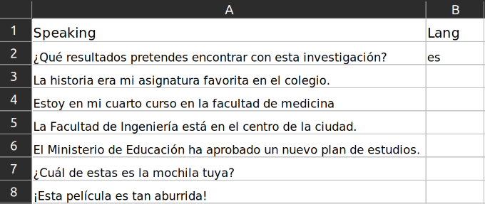
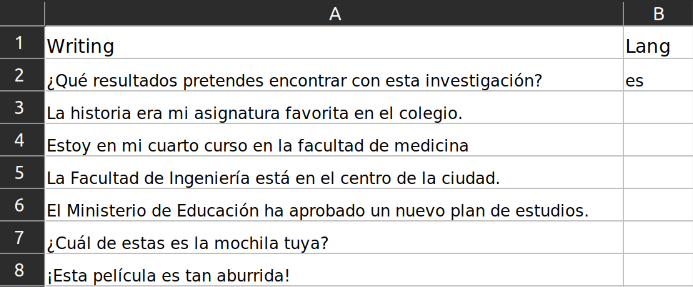
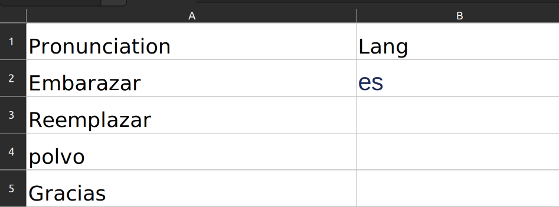
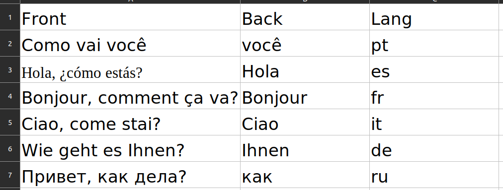

# *CardMaker is a code to quickly create anki language learning cards*

## Run in Google Colab
It is possible to execute the code on Google Colab by using the **Anki CardMaker (google colab)**. The code remains the same and can be accessed by following this [link](https://colab.research.google.com/github/viniciusdutra314/Anki-CardMaker/blob/main/Google%20colab%20(CardMaker).ipynb).

## Creator
My name is Vinícius Dutra and I am presently pursuing a degree in computational physics at USP São Carlos. I am also the founder of the Brazilian YouTube channel known as [Singularidade](https://www.youtube.com/Singularidade). I have produced a video that explains the code in question, which is essentially the same information that is presented in written form here. The video has been subtitled in multiple languages, if you wish to view the video, please follow this link: [not yet published]

## What it does?
To utilize this tool, it is necessary to compile your foreign language phrases into an Excel spreadsheet. The code will then highlight specific words within your phrases that you may wish to learn the translation of, and provide a suggested translation for each highlighted word. Moreover, the code generates a temporary translation of the phrase and **ChatGPT** copy-to-past prompts to assist in verifying the accuracy of the word translations. 

In the event of any inaccuracies, the code allows for manual editing and then subsequently produces an Anki file (.apkg file), which can be imported into your existing Anki deck. The code offers four distinct card modes, namely **vocabulary, speaking, writing, and pronunciation**, among several other features which shall be elaborated upon in subsequent sections.

## Type of Cards
### Formatting
All the excel tables used are in the folder [Tables examples](https://github.com/viniciusdutra314/CardMaker/tree/main/Tables%20examples). All the examples were created thinking of a person that was studying Spanish.
Each card type has a specific formatting requirement. Please note that the **first row will be ignored**, and therefore the headers are solely for the purpose of guidance. It is crucial to be mindful of the card type being utilized and to format the phrases or words accordingly.
### Lang column
Its important to note that you should specify what language your studying, If you are focusing on a single language, it is necessary to indicate the language name using the two-letter format. Conversely, if multiple languages are being studied, each row should indicate the corresponding language. For more detailed information, please go the [Language section](#language-support-200)

# Vocabulary
You need to place the phrases that you wish to learn within the Front column of the excel table, and the words that you are unfamiliar with within the Back column.

The front of the generated card will display the original phrase, with the targeted word highlighted to draw attention to it. The back of the card will provide the translation of the highlighted word, and will include an audio component for both the front and back of the card.

# Speaking
In the first column **Speaking** you should put the phrase that you want to speak, it is important to note that there is no accompanying third column.

The underlying concept is to cultivate an active vocabulary, whereby the learner is presented with a phrase that must be verbalized in a foreign language.

# Writing
The "Writing" card type is analogous to the "Speaking" card type

This mode is based on the "type in answer", whereby the user is tasked with training their writing skills and any errors made during the process will be denoted in red.

# Pronunciation
Make a list of all the words or phrases that you want to learn how to pronounce

The front is the word that you're learning how to pronounce and the back is one audio with the pronunciation

## Checking Modes: 

A spreadsheet entitled "checktable.xlsx" will be generated, with the current state for phrases, words, translated words, translated phrases, and ChatGPT prompts, which are elaborated in the next section. In the event that corrections or modifications are required, the user may simply alter the corresponding cells within the spreadsheet and save the updated document under the name "verifiedtable.xlsx".

## ChatGPT
The usage of the ChatGPT API is indeed restricted and needs a unique key for each individual user. However, the code in question does not require the use of the ChatGPT API and therefore does not need any key for operation. The code generates prompts that can be easily copy-pasted into ChatGPT for those seeking assistance. It is worth noting that ChatGPT has the capability to provide detailed explanations as to why a specific word is used in a given phrase, as well as elucidate the overall meaning of the entire phrase. This makes it an excellent tool for those seeking to deepen their understanding of foreign languages and idiomatic expressions.

## Language Support (+200):
This code utilizes the Google Translate API for translation and audio generation purposes. Theoretically, the code should be compatible with all languages supported by the API. A comprehensive list of all supported languages can be found at the following [link](https://cloud.google.com/text-to-speech/docs/voices?hl=pt-br)

## Choose the language that your cards will be translated
The code has been implemented in multiple languages. The initial line prompts the user to specify their desired language in a 2-character format. In case you are unfamiliar with the proper 2-character code for your language, or if it is not supported, please refer to the following [link](https://py-googletrans.readthedocs.io/en/latest/). To demonstrate the efficacy of this tool in various languages, the complete code has been provided in Japanese, utilizing "ja" as the designated language code.

## Multiple Languages in one Deck
The "lang" column is utilized in all types of cards. **If the cards are in a single language, it is only necessary to specify it once at the first row**. However, the code is capable of handling multiple languages within a single Excel table. The subsequent example showcases the usage of a vocabulary card, but the concept remains applicable to all types of cards.

